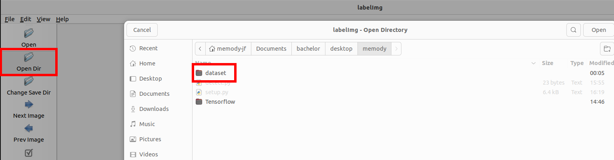
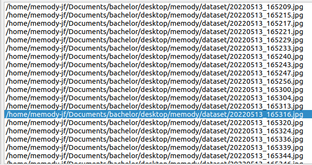
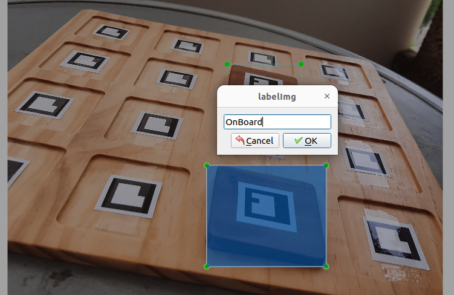

# Marche a suivre pour labelliser les images:

## (optionel) mettre en place un environnement virtuel

    python3 -m venv labelImg_env

## activer l'environnement virtuel

    source labelImg_env/bin/activate

### si vous souhaitez quitter l'environnement virtuel

    deactivate

## installer le programme labelImg : 

    pip install labelImg

## lancer le programme :

    labelImg

1) cliquez sur **opendir** et ouvrez le dossier contenant les images:

2) en bas a droite se trouve toutes les images du répertoire, il suffit de faire un double clic pour changer d'images (**n'oubliez pas de sauvegarder vos modifications lorsque vous changez d'images ou vous risquez de tout perdre :cry:**)

3) Pour labeliser une partie de l'image appuyer sur le bouton: **Create RectBox** ou utiliser le racourci **w**. 
4) Encadrer la partie qui doit être labelisée, une fenêtre s'ouvre, entrer le nom du label correspondant (le nom du label est [sensible à la casse](https://fr.wikipedia.org/wiki/Sensibilit%C3%A9_%C3%A0_la_casse)).

note: les labels qui sont utilisés dans le projet sont : OnBoard (pièce présente), Empty (pièce non présente sur le plateau)

5) Lorsqu'il faut exporter les images, compressez tout le dossier contenant les images et les fichiers xml.

## informations supplémentaires: 

il est possible de modifier un rectangle en cliquant sur l'un de ses bords. 

Pour sauvegarder utiliser le racourci **ctrl+s**.

Le fichier est sauvegardé sous le même nom dans le même dossier en un format [xml](https://fr.wikipedia.org/wiki/Extensible_Markup_Language)

Le fichier xml contient les informations: le nom du dossier, le nom du fichier, le chemin vers ce fichier, informations liés à l'image (taille, canaux de couleurs), les objets qui ont été labelisé avec le nom du label et les coordonnées.

